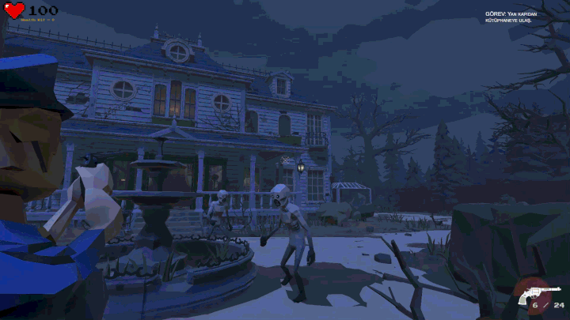
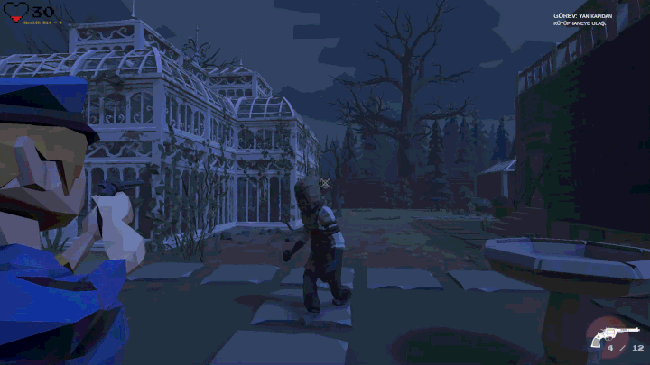
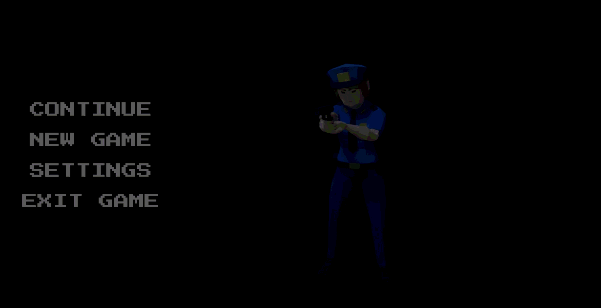

# Project: Macula

Third Person Survival/Gerilim oyunu — Unity 6000.0.58f1 LTS ile geliştirilmiştir.

## Geliştirici Ekibi
Bu proje 3 kişilik bir ekip tarafından geliştirilmiştir:
- **Sudenaz Güldal** — Game Design, Narrative & Gameplay — [@sudenazguldal](https://github.com/sudenazguldal)
- **Melike Kır** — Enemy AI & Combat Systems — [@melike-kIr](https://github.com/melike-kIr)
- **Merve Gazioğlu** — UI/UX Design & System Development — [@merwf](https://github.com/merwf)

## İçindekiler
- [Oyunun Özellikleri](#oyunun-özellikleri)
- [Oyuncu (Player) Mekanikleri](#oyuncu-player-mekanikleri)
- [Düşman (NPC) Yapay Zekâsı](#düşman-npc-yapay-zekâsı)
- [Kullanıcı Arayüzü (UI)](#kullanıcı-arayüzü-ui)
- [Proje Mimarisi ve Script Yapısı](#proje-mimarisi-ve-script-yapısı)
- [Geliştirme Ortamı](#geliştirme-ortamı)
- [Kullanılan Eklentiler ve Teknolojiler](#kullanılan-eklentiler-ve-teknolojiler)
- [Senaryo](#senaryo)
- [Sistem Blok Diyagramı](#sistem-blok-diyagramı)
- [Teknik Zorluklar ve Çözümler](#teknik-zorluklar-ve-çözümler)
- [Literatür Taraması](#literatür-taraması)
- [Projemizin Farklılıkları ve Katkıları](#projemizin-farklılıkları-ve-katkıları)
- [Bilinen Kısıtlar ve Gelecek Çalışmalar](#bilinen-kısıtlar-ve-gelecek-çalışmalar)

## Oyunun Özellikleri
Bu proje, TPS türünün temel mekaniklerini barındıran, yapay zekâ destekli düşman karakterler (NPC) içeren bir oyun geliştirmeyi amaçlamaktadır.
Geliştirilen oyun, oyuncuya temel TPS deneyimini sunarken; kamera, hareket, animasyon, ateş etme ve siper alma sistemleriyle birlikte eksiksiz bir oynanış akışı sağlamaktadır. Oyun PC platformu için geliştirilmiş olup, Unity oyun motoru kullanılarak inşa edilmiştir.
Grafikler low-poly tarzında seçilmiş ve performans odaklı bir yapı benimsenmiştir. Ortam görselleri, Synty Studios'a ait **PolygonHorrorMansion** asset paketi temel alınarak sahnelenmiştir.

### Oyuncu (Player) Mekanikleri
Oyuncu karakteri, Third Person Controller altyapısına sahiptir.
+ Hareket sistemi WASD tuşlarıyla yürüyüş ve koşma kontrolünü sağlar; Animator Controller içerisindeki layer ve rig yapılarıyla gerçekçi bir hissiyat oluşturur.
+ **C** tuşuna basarak toggle, **Left Ctrl** tuşuna basılı tutarak ise geçici siper alma/crouch gerçekleştirilebilir. Siper alma ve crouch mekanikleri birbirine bağlıdır: karakterin önünde cover alınabilecek bir nesne varsa cover alınır, aksi halde crouch'a geçilir. Oyuncu cover sırasında aldığı nesneden uzaklaşırsa otomatik olarak crouch pozisyonuna döner; bu geçişler görünürlük (visibility) durumuna göre dinamik olarak değişir.
+ Kamera sistemi, Third Person ve Aim Camera arasında geçiş yapabilen dinamik bir Camera Switcher yapısına sahiptir.
+ Ateş etme (shooting) mekanikleri aktiftir; nişan alma sırasında kamera dinamik olarak yakınlaşır ve "over the shoulder" hissiyatı sağlanır. Karakter nişan durumunda (Aim Cam) değilse ateş edemez — bu kısıt, oyuncunun rastgele ateş etmesini engelleyip nişan almayı taktiksel bir zorunluluk haline getirir.
+ Avatar Mask ve Blend Tree yapılarını kullanan gelişmiş animasyon sistemi sayesinde karakterin yürüme, nişan alma, crouch, siper alma ve ateş etme hareketleri arasında akıcı geçişler sağlanmıştır.
+ Eşya toplama, envanterde saklama ve kullanma XEntity GameKit altyapısı üzerine entegre edilmiştir.
+ İlerleme; oyuncu konumu, sağlık ve cephane bilgileriyle birlikte Esper Save System aracılığıyla kaydedilip yüklenebilir.

### Düşman (NPC) Yapay Zekâsı
Düşman karakterleri, NavMesh Agent tabanlı bir navigasyon sistemi ile oyuncuyu tespit eder ve takip eder. Düşman davranışları; **Idle, Patrol, Chase, Attack ve Death** durumları arasında geçiş yapan bir Finite State Machine (FSM) yapısıyla kontrol edilmektedir.
`enemy.cs` içerisindeki Enemy Controller mantığı, Animator parametreleriyle entegre çalışarak düşmanların oyuncuya tepki vermesini, belirli alanlarda devriye gezmesini ve saldırı gerçekleştirmesini sağlar. Düşman canı `HealthEnemy.cs` üzerinden yönetilir ve ölüm durumunda ilgili state'e geçiş tetiklenir.
Düşmanlar, `EnemySpawner.cs` ve `EnemyActivator.cs` script'leri aracılığıyla belirli bölgelerde dinamik olarak oluşturulmakta ve oyuncunun ilerlemesine bağlı olarak aktive edilmektedir. Senaryonun final bölümünde ayrıca özel bir boss davranışı (`doctor.cs`) bulunmaktadır.

### Kullanıcı Arayüzü (UI)
Kullanıcı arayüzü, oyuncuya oyun içi bilgileri sade ve okunabilir biçimde sunacak şekilde tasarlanmıştır. Tüm UI alt sistemleri (`UIManager.cs`), objective, notification ve dialogue akışlarını tek bir merkezden yönetecek şekilde birleştirilmiştir.
+ **Can Barı (Health Bar):** Oyuncunun sağlık durumunu `PlayerHealth.cs` ve `HealthUI.cs` üzerinden anlık olarak gösterir.
+ **Cephanelik Göstergesi (Ammo Display):** `RevolverAmmoDisplay.cs` ve `WeaponAmmo.cs` ile şarjörde kalan mermi miktarını gösterir.
+ **Pause Menu:** Oyunun durdurulması, devam ettirilmesi, baştan başlaması, kaydedilmesi veya ana menüye dönülmesini sağlar (`PauseMenu.cs`).
+ **Main Menu:** Oyunun açılış ekranıdır; oyuna kaldığı yerden devam etmeyi, baştan başlamayı, ayarlar menüsüne yönlendirmeyi veya oyundan çıkmayı sağlar (`MainMenu.cs`, `ButtonMainMenu.cs`).
+ **Settings Menüsü:** Ses, grafik ve kontrol ayarlarının düzenlenmesine olanak tanır (`SettingsMenu.cs`, `QualityButtonUI.cs`).
+ **Kayıt Sistemi (Save/Load):** Oyunun ilerleyişi `PlayerSaveData.cs` ve `PersistSaveSystem.cs` aracılığıyla kaydedilebilir ve yeniden yüklenebilir.
+ **Eşya Toplama Sistemi:** Oyuncu belirli nesneleri `PickupItem.cs` ve `InventoryCollector.cs` üzerinden toplayabilir, saklayabilir ve kullanabilir.
+ **Crosshair Seçimi:** Oyuncu nişangah tasarımını kendi tercihine göre değiştirebilir (`CrosshairController.cs`, `WorldCrosshairController.cs`, `CrosshairVisibility.cs`).
+ **Notification Sistemi:** Toplanan malzemeyi bildirim olarak gösterir.
+ **Objective Sistemi:** Oyuncunun yapması gereken görevleri gösterir ve oyuncunun hikâyede kaybolmasını engeller.

## Proje Mimarisi ve Script Yapısı
Proje, Component-Based Architecture prensiplerine uygun olarak, her sistemin kendi sorumluluğunu üstlendiği bağımsız script'lerden oluşmaktadır (`Assets/Scripts/`):

| **Katman**              | **Script'ler**                                                                 | **Sorumluluk**                                              |
| ------------------------ | -------------------------------------------------------------------------------- | ------------------------------------------------------------ |
| Oyuncu Kontrolü           | `PlayerController.cs`, `PlayerEnums.cs`                                          | Hareket, koşma, crouch, cover state yönetimi                 |
| Kamera                    | `CameraSwitcher.cs`, `AimCameraController.cs`                                    | Third Person / Aim Camera geçişleri                          |
| Ateş Etme                 | `PlayerShooting.cs`, `WeaponAmmo.cs`, `BattleDamage.cs`, `BoneDamage.cs`         | Ateş etme, mermi yönetimi, hasar hesaplama                   |
| Düşman AI                 | `enemy.cs`, `doctor.cs`, `HealthEnemy.cs`, `EnemySpawner.cs`, `EnemyActivator.cs` | FSM tabanlı davranış, boss mantığı, düşman oluşturma         |
| Envanter / Eşya           | `InventoryCollector.cs`, `InventoryData.cs`, `InventoryHUDDisplay.cs`, `PickupItem.cs` | Eşya toplama, saklama, HUD gösterimi                     |
| Sağlık Sistemi             | `HealthCompenent.cs`, `PlayerHealth.cs`, `HealthUI.cs`                          | Oyuncu ve düşman can yönetimi                                 |
| UI / Menüler               | `UIManager.cs`, `MainMenu.cs`, `PauseMenu.cs`, `SettingsMenu.cs`, `ButtonHoverEffect.cs`, `ButtonMainMenu.cs`, `MenuSlideshow.cs` | Menü akışları, ayarlar, buton etkileşimleri |
| Kayıt Sistemi              | `PlayerSaveData.cs`, `PersistSaveSystem.cs`                                     | Esper Save System entegrasyonu                                |
| Diğer Sistemler            | `SceneChanger.cs`, `PressKeyOpenDoor.cs`, `CursorManager.cs`, `FileDeleter.cs`, `PathDebugger.cs` | Sahne geçişleri, etkileşimli kapılar, yardımcı araçlar |

Dış paketler (`Assets/Package/`) altında **XEntity GameKit** (envanter/etkileşim altyapısı), **JMO Assets WarFX** (efekt sistemleri) ve **PolygonHorrorMansion** (ortam modelleri) yer almaktadır.

## Geliştirme Ortamı
+ **Oyun Motoru:** Unity 6000.0.58f1 LTS
+ **Programlama Dili:** C#
+ **IDE:** Visual Studio 2022
+ **Versiyon Kontrol:** Git & GitHub (proje iş birliği ve yedekleme amaçlı)
+ **Hedef Platform:** Windows (PC)
+ **Render Pipeline:** Unity URP (Universal Render Pipeline)

## Kullanılan Eklentiler ve Teknolojiler

Projede geliştirilen mekaniklerin yanında, oyun deneyimini desteklemek için çeşitli Unity bileşenleri, sistemleri ve eklentilerden yararlanılmıştır:

| **Kategori**           | **Kullanılan Sistem / Araç**              | **Açıklama**                                                   |
| ---------------------- | ----------------------------------------- | -------------------------------------------------------------- |
| **Karakter Kontrolü**  | Character Controller, Cinemachine         | TPS ve Aim kamera geçişi, kamera takibi                        |
| **Yapay Zekâ (AI)**    | NavMesh Agent, FSM State Scripts          | Düşmanların devriye, takip ve saldırı davranışları             |
| **Animasyon**          | Animator, Blend Tree, Avatar Mask         | Yürüme, nişan alma, cover ve atış animasyon geçişleri          |
| **Ses Sistemi**        | Audio Mixer, Audio Source                 | Arka plan müziği, efekt sesleri, menü sesleri                  |
| **UI Sistemi**         | Unity UI Toolkit (Canvas, Slider, Button) | Can barı, cephane göstergesi, menüler ve ayarlar               |
| **Envanter Sistemi**   | XEntity GameKit                           | Eşya toplama, saklama ve etkileşim altyapısı                   |
| **Görsel Efektler**    | JMO Assets WarFX                          | Atış efektleri, mermi izi ve ışık titreşimi                    |
| **Ortam Varlıkları**   | PolygonHorrorMansion (Synty Studios)      | Konak, mobilya ve çevre modelleri                               |
| **Kayıt Sistemi**      | Esper Save System                         | Oyuncu konumu, sağlık ve cephane verilerinin kaydedilmesi      |
| **Sürüm Takibi**       | GitHub Desktop                            | Ekip üyeleri arasında kod senkronizasyonu ve versiyon kontrolü |

## Senaryo
**Oyun Adı:** Project: Macula
**Tür:** Üçüncü Şahıs (TPS) – Hayatta Kalma / Gerilim

### 1. Giriş (Prologue)
Oyun, Polis Memuru karakterinin, terk edilmiş ve lanetli olarak bilinen "Horror Mansion" bölgesine tekrar gönderilmesiyle başlar. Merkez, konaktan gelen "asılsız çığlık" ihbarlarını araştırmaktadır.
Ancak karakterin bu eve gelişi tesadüf değildir. Oyuncu, Doktor'un deneylerinden "o gece" kaçmayı başaran tek "kusurlu" denektir. Gelen ihbarlar aslında Doktor'un, kaçan deneği (oyuncuyu) geri çağırma yöntemidir.

### 2. Yükseliş (Rising Action)
**Evle Yüzleşme:** Oyuncu konağa yaklaştıkça geçmiş travmaları tetiklenir.
> "Yine mi bu ev?... Biliyorum, bu lanet yerin benimle işi daha bitmedi."

**Sesin Keşfi:** Evin içinden gelen ağlama seslerinin "asılsız" değil, gerçek olduğu fark edilir.
> "Kahretsin... İşte o ses. Demek ihbarlar... bu kez gerçekti."

**Tuzak:** Oyuncu ana kapıyı açtığında Doktor'un tuzağı tetiklenir; zombiler serbest kalır, müzik gerilime dönüşür.
Görev: "Kütüphaneye ulaş."
> "Yine başlıyor... Olamaz, yine o geceki gibi! Kütüphaneye ulaşmam lazım... Yan kapıdan!"

Kütüphane kapısına ulaşan oyuncu kapının kilitli olduğunu görür.
> "Kilitli... Tabii ki kilitli. Biliyordum... Beni yine buraya çekeceğini biliyordum. 'O gece' yarım kalan hesabı bitirmenin vakti geldi, Doktor."
Görev Güncellemesi: "Anahtarı bul."

### 3. Zirve (Climax) – Yüzleşme
Oyuncu anahtarı bulur ve Kütüphane kapısını açar. Bu anda `FinalConfrontation` tetiklenir: oyuncu kontrolü devre dışı bırakılır, kamera sabitlenir.

**Doktor:** "İnanılmaz. Bütün kusursuz yaratıklarımın arasından sıyrılıp yine geldin. Sen bu deneyin en inatçı çarpıklığısın."
**Oyuncu:** "Deney bitti, Doktor. Yarım kalan ne varsa bu gece sona erecek."

Diyalog bitince "Delirme Anı (Delirium)" başlar: ekran titreşir, sesler boğulur, ağlama sesi duyulur. Oyuncu, Doktor'a nişan almak zorundadır.

### 4. Çözüm (Resolution) – Son Atış
Oyuncu ateş ettiğinde ve Doktor'un canı sıfıra indiğinde: Doktor ölür, `FinalConfrontation` tüm sesleri ve efektleri durdurur, zaman durur (`Time.timeScale = 0f`) ve oyun sona erer.

## Sistem Blok Diyagramı

Aşağıda *Project: Macula* oyununda kullanılan temel sistem bileşenleri ve aralarındaki ilişki gösterilmektedir:

```mermaid
flowchart TB

    %% =========================
    %% PLAYER
    %% =========================
    Player["🎮 PLAYER<br/>Oyuncu Sistemi"]

    PlayerController["Player Controller<br/>Hareket • Koşma • Crouch • Cover"]
    Camera["Camera Switcher<br/>Third Person • Aim Camera"]
    Shooting["Player Shooting<br/>Nişan Alma • Ateş Etme"]
    Animation["Animator<br/>Blend Tree • Avatar Mask"]

    Player --> PlayerController
    Player --> Camera
    Player --> Shooting
    Player --> Animation

    %% =========================
    %% ENEMY AI
    %% =========================
    Enemy["👾 ENEMY AI<br/>Düşman Sistemi"]

    NavMesh["NavMesh Agent<br/>Navigasyon"]
    FSM["Finite State Machine<br/>Idle • Patrol • Chase • Attack • Death"]
    EnemyController["Enemy Controller<br/>Davranış Yönetimi"]
    Spawner["Spawner System<br/>Düşman Oluşturma"]

    Enemy --> NavMesh
    Enemy --> FSM
    Enemy --> EnemyController
    Enemy --> Spawner

    %% =========================
    %% CORE GAMEPLAY
    %% =========================
    Core["⚙️ CORE GAMEPLAY SYSTEMS"]

    UIManager["UIManager<br/>UI • Objective • Notification • Dialogue"]
    Inventory["Inventory / Item System<br/>Eşya Toplama • Saklama • Kullanma"]
    SaveLoad["Save / Load System<br/>Oyun İlerlemesi • Oyuncu Verileri"]
    Final["FinalConfrontation<br/>Final Diyaloğu • Delirium • Son Atış"]

    Core --> UIManager
    Core --> Inventory
    Core --> SaveLoad
    Core --> Final

    %% =========================
    %% UI
    %% =========================
    UI["🖥️ USER INTERFACE"]

    Health["Health Bar"]
    Ammo["Ammo Display"]
    Menus["Main Menu • Pause Menu"]
    SettingsNode["Settings"]
    Crosshair["Crosshair Selection"]
    Objective["Objective"]
    Notification["Notification"]

    UI --> Health
    UI --> Ammo
    UI --> Menus
    UI --> SettingsNode
    UI --> Crosshair
    UI --> Objective
    UI --> Notification

    %% =========================
    %% AUDIO
    %% =========================
    Audio["🔊 AUDIO SYSTEM"]

    AudioMixer["Audio Mixer"]
    Music["Background Music"]
    SFX["Sound Effects"]
    DynamicAudio["Dynamic Music Transitions"]

    Audio --> AudioMixer
    Audio --> Music
    Audio --> SFX
    Audio --> DynamicAudio

    %% =========================
    %% ENVIRONMENT
    %% =========================
    Environment["🏚️ GAME ENVIRONMENT"]

    Level["Level / Scene"]
    Cover["Cover Objects"]
    SpawnPoints["Spawn Areas"]
    Lighting["Lighting & Atmosphere"]

    Environment --> Level
    Environment --> Cover
    Environment --> SpawnPoints
    Environment --> Lighting

    %% =========================
    %% RELATIONSHIPS
    %% =========================

    PlayerController --> Animation
    Camera --> Shooting
    Shooting --> Enemy

    EnemyController --> FSM
    FSM --> NavMesh
    Spawner --> Enemy

    PlayerController --> UIManager
    Shooting --> UIManager
    Inventory --> UIManager
    Final --> UIManager

    UIManager --> UI

    UI --> SettingsNode
    UI --> Audio

    SaveLoad --> Inventory
    SaveLoad --> PlayerController

    Environment --> PlayerController
    Environment --> Enemy

    Final --> Shooting
    Final --> Audio

    %% =========================
    %% STYLE
    %% =========================

    classDef player fill:#e3f2fd,stroke:#1565c0,stroke-width:2px;
    classDef enemy fill:#ffebee,stroke:#c62828,stroke-width:2px;
    classDef core fill:#f3e5f5,stroke:#6a1b9a,stroke-width:2px;
    classDef ui fill:#fff3e0,stroke:#ef6c00,stroke-width:2px;
    classDef audio fill:#e8f5e9,stroke:#2e7d32,stroke-width:2px;
    classDef environment fill:#fce4ec,stroke:#ad1457,stroke-width:2px;

    class Player,PlayerController,Camera,Shooting,Animation player;
    class Enemy,NavMesh,FSM,EnemyController,Spawner enemy;
    class Core,UIManager,Inventory,SaveLoad,Final core;
    class UI,Health,Ammo,Menus,SettingsNode,Crosshair,Objective,Notification ui;
    class Audio,AudioMixer,Music,SFX,DynamicAudio audio;
    class Environment,Level,Cover,SpawnPoints,Lighting environment;
```

##  Teknik Zorluklar ve Çözümler
* Enemy'ler oyuncuyu sürekli takip edecek şekilde ayarlandığından, saldırı durumundayken oyuncu hareket ettiğinde kayarak takip ediyorlardı. İki gün süren uğraşlarım sonucunda, sorunun animatördeki "Has Exit Time" seçeneğini kapatmamla düzeldiğini fark ettim.
* Projemiz düz bir zeminden oluşmadığı için, NavMesh Surface yere yerleştirilen küçük objeleri de dahil ediyordu. Bu durum, düşmanların bazen havada durmasına veya bazı bölgelerde geçişleri engel olarak algılayıp NavMesh yüzeyinin birleşmemesine neden oluyordu. İlk etapta tek tek duvarları ve yerdeki küçük eşyaları kaldırarak sorunu çözmeye çalıştım bu çözümün sonucunda haritanın anlamsız yerlerinde ev eşyaları bulmamızla sonladı (çalılıkların arasında uçan kitaplar vb.);  asıl çözümün, AI Navigation ayarlarını küçülterek sağlandığını fark ettim.
* Enemy'lerin animasyonlarında zaman zaman beklenmeyen hatalar oluşuyor. Bazen animasyonlar düzgün şekilde çalışırken, bazen de hareketler yanlış bir biçimde tekrar ediyor. Bu sorunun nedenini tam olarak tespit edemedim.
* Karakter crouch pozisyonuna girip haraket edince sol elı anlamsız bir şekilde havaya kaldırıp görüntünün gerçekçiliğini bozuyordu, avatar mask kullanarak sadece sol eli etkileyen bir layer oluşturup çözdüm.
* Bulduğum animasyonlarla karakterlerin root sisteminin isimlendirmesi uyuşmuyordu. Blender kullanarak kemikleri tekrar isimlendirdim. 2 günlük bu emeğin sonunda başka karakter kullanmaya karar verip olası yeni sounları çözdüm.
* Objective, Notification, Dialogueların hepsini ayrı ayrı yerlerden kontrol etmek zor ve çok hata çıakrtan bir sistem olduğu için hepsini bir UIManager altında birleştirdim.
+ Pause menü tasarımı için harika bi asset bulmuştum ama unity ile uyumlu olmadığı için paneli kendim yapmak zorunda kaldım. Buna rağmen çok temiz aktı. Sonrasında main menüyü'de pause menüden alırım dedim. Ama sebebini anlamadığım bir şekilde main menüdeki butonlar çalışmadı. Saatlerce uğraşmalarımın sonucu boşa çıkınca paneli komple sildim. Tekrar yaptım ve tabii ki yine çalışmadı. Derin hezeyanlarımdan sonra tekrar silip yaptım ve ne fark ettim biliyor musunuz? panele vertical group layer eklediğimden dolayı yüksekliği sabitliyor ve nedendir bilinmez 0'a sabitliyormuş. Yüksekliği 0 olan butonların neden çalışmadığını anlamış oldum. Ama bu durumu peşimi daha sonrasında da bırakmadı.Butonlar çalışmıyorsa projenin input sistemi hatalı herhalde diyerekten input sistemini değiştirmişim sonra butonlar çalışıncada sistemi tekrardan değiştirmeyi unutma gafletinde bulunmuşum. 1 gün sonra paneli kontrol edeyim diye editörü çalıştırayım dedim, bizim başkarakter zemine sen gömül ve çıkma. Bi 3,4 saatte onunla uğraştım. Daha da akıllandım input sistemi ile oynamıyorum. Bir de group layer kullanmıyorum tabii.
+ Settings kısmına nişan hassasiyetini ekledikten sonra bi' heves karakter hassasiyeti de ekleyeyim dedim. Karakter tüm dönebilme kabiliyetini kaybedince ve yarışçı arazi arabaları gibi bi o yana bi bu yana savrulunca bu hevesten vazgeçtim.
+ Settings kısımındaki ses sliderleri için başta aralık olarak -80dB 0dB aldım. Fakat ses henüz %75'teyken 0'landığı için desibeli -20'ye çekmeye karar verdim. İyi bir karardı.
* ### MERGE

## Literatür Taraması
| **Özellik**        | **Projemiz (Project: Macula)**                     | **Resident Evil 2 (Remake)**            | **Silent Hill 2 (Remake)**        | **The Evil Within**            | **The Last of Us (Part I)**   |
| ------------------ | -------------------------------------------------- | --------------------------------------- | --------------------------------- | ------------------------------ | ------------------------------ |
| **Oyun Motoru**    | Unity 6                                            | RE Engine                               | Unreal Engine 5                   | id Tech 5 (Modifiye)           | Naughty Dog Engine            |
| **Ana Tema**       | Psikolojik Gerilim (Deney, Travma)                 | Hayatta Kalma Korkusu (Biyolojik Silah) | Psikolojik Korku (Kişisel Travma) | Psikolojik Korku (Görsel/Gore) | Hayatta Kalma (Anlatı Odaklı) |
| **Kamera**         | TPS (Omuz Üstü Aim)                                | TPS (Omuz Üstü Aim)                     | TPS (Omuz Üstü)                   | TPS (Omuz Üstü)                | TPS (Omuz Üstü)               |
| **AI Sistemi**     | FSM + NavMesh                                      | Gelişmiş FSM / Davranışsal              | FSM                               | FSM + Behavior Tree            | Gelişmiş FSM / Davranışsal    |
| **Pathfinding**    | NavMesh                                            | NavMesh (Özel)                          | NavMesh                           | NavMesh                        | NavMesh                       |
| **Harita Yapısı**  | Kapalı Mekan (Korku Konağı)                        | Kapalı Mekan (Lineer İlerleme)          | Yarı-Açık Dünya (Kasaba)          | Bölüm Bazlı (Lineer)           | Geniş Lineer (Wide–Linear)    |
| **Düşman Türleri** | Çoklu Türler (Warden, Gorgon, Doktor vb.)          | Çoklu Türler                            | Çoklu Türler                      | Çoklu Türler                   | Çoklu Türler                  |
| **Ses Sistemi**    | Dinamik 3D + 2D Müzik *(Atmosfer ve Müzik Geçişi)* | 3D Çevresel (Binaural)                  | 3D Çevresel                       | 3D Çevresel                    | 3D Çevresel                   |

## Projemizin Farklılıkları ve Katkıları

### 1. Basitleştirilmiş ve Anlaşılır AI Sistemi
Literatürde yer alan karmaşık Behavior Tree (Davranış Ağacı) sistemleri yerine, anlaşılması ve yönetilmesi daha kolay olan FSM (Finite State Machine – Sonlu Durum Makinesi) yaklaşımı kullanılmıştır.
Bu yöntem, özellikle Unity öğrenen öğrenciler ve yeni başlayan geliştiriciler için daha erişilebilir ve öğretici bir yapı sunmaktadır.

🔹 Resident Evil 2 Remake ve The Last of Us gibi AAA oyunlarda karmaşık davranış ağaçları kullanılırken, projemiz öğretici amaçla sadeleştirilmiş bir FSM sistemini tercih etmiştir.

### 2. Eğitim Odaklı ve Modüler Yapı
Her sistem (`PlayerController`, `PlayerShooting`, `InventoryCollector`, `UIManager` vb.) kendi sorumluluğunu bilen bağımsız component (bileşen) olarak tasarlanmıştır.
Bu yapı, Component-Based Architecture prensiplerini doğrudan göstermekte ve gelecekte yapılacak yeni mekanik eklemeleri için kolaylık sağlamaktadır.

🔹 Bu sayede oyun, Silent Hill 2 Remake gibi büyük ölçekli yapılara benzer bir organizasyon modelini eğitim ortamına uygun şekilde örneklemektedir.

### 3. Esnek Kontrol Mekanikleri
Projemiz, oyuncu konforunu (Quality of Life) ön planda tutarak, siper alma mekaniği için hem
- Toggle (Bas-Çek – C tuşu)
- Hold (Basılı Tut – Ctrl tuşu)

seçeneklerini aynı anda destekler. Bu esneklik, türün birçok örneğinde bulunmayan bir kullanıcı deneyimi sağlamaktadır.

🔹 Bu özellik, The Last of Us ve Resident Evil 2 Remake gibi modern TPS oyunlarında dahi nadir görülen bir çift kontrol seçeneği sunar.

### 4. Settings Ayarları
Modern oyunlarda "Settings" menüsü yalnızca ses ve grafik ayarlarını değil, erişilebilirlik ve kişiselleştirme seçeneklerini de içerir.
Projemizde:
- **Ses Kontrolleri:** Master, Müzik, SFX ayrı ayrı ayarlanabilir.
- **Görüntü Kalitesi:** Kalite seviyeleri ve tam ekran seçenekleri.
- **Kontrol Hassasiyeti:** Nişangah (crosshair) tipi seçimi ve aim hassasiyeti ayarları.

🔹 Bu yapı, Resident Evil 2 Remake gibi AAA oyunların menü sistemlerinden ilham alarak sadeleştirilmiş bir versiyon olarak tasarlanmıştır.

### 5. Sık Tekrar Eden Nesneler
Oyun geliştirme literatüründe, sık tekrar eden nesnelerin (örneğin düşmanlar veya mermiler) sürekli oluşturulup silinmesi performans kaybına yol açabilir. Bu nedenle Object Pooling (Nesne Havuzu) yöntemi önerilmektedir.
Projemizde bu sistem henüz uygulanmamıştır; ancak ilerleyen aşamalarda havuz mantığı ile respawn işlemleri daha verimli hale getirilebilir.

🔹 Bu, The Evil Within gibi çok düşman içeren sahnelerde kullanılan optimizasyon tekniklerinin sadeleştirilmiş versiyonudur.

### 6. Harita ve Atmosfer Tasarımı
Proje, Resident Evil 2 ve Silent Hill 2'deki gibi kapalı, baskılayıcı mekân hissi yaratmayı amaçlamaktadır.
Yalnızca "Korku Konağı" gibi küçük ama detaylı bir alan tasarımıyla, narratif yoğunluk (hikâye odaklı deneyim) ön plana çıkarılmıştır.

🔹 Küçük alan + yüksek detay, performansı artırırken atmosfer derinliğini korur.

### 7. Ses ve Müzik Sistemi
Projemiz, 2D arka plan müziği ile 3D çevresel ses sistemini birleştirir. Oyun içi müzik geçişleri, oyuncunun bulunduğu alana ve duruma göre dinamik olarak değişmektedir.

🔹 Bu yaklaşım, AAA oyunlardaki karmaşık "adaptive audio" sisteminin basitleştirilmiş bir eğitim versiyonudur.

## Bilinen Kısıtlar ve Gelecek Çalışmalar
- **Object Pooling** henüz uygulanmamıştır; çok sayıda düşman/mermi bulunan sahnelerde performans optimizasyonu için önerilmektedir.
- Düşman animasyonlarında zaman zaman gözlemlenen tutarsız tekrar davranışlarının kök nedeni netleştirilmemiştir; ileriki sürümlerde Animator state geçiş koşullarının detaylı incelenmesi planlanmaktadır.
- Karakter (mouse) hassasiyeti ayarı, mevcut kamera/rotasyon mimarisiyle stabil çalışmadığından şimdilik yalnızca nişan hassasiyeti kullanıcıya açık bırakılmıştır.
